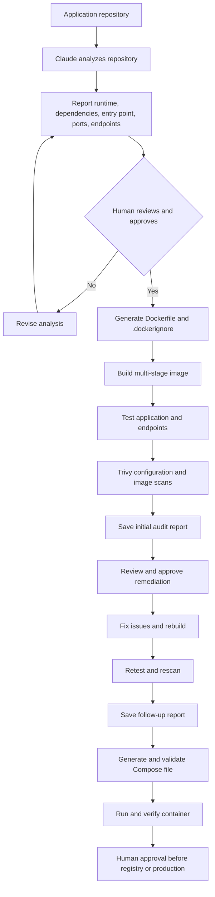
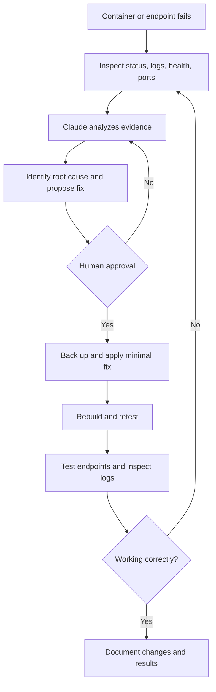

# Day 3 Workflow Diagrams

## AI-native Docker and DevSecOps workflow

```mermaid
flowchart TD
    A[Application repository] --> B[Claude analyzes repository]
    B --> C[Report runtime, dependencies, entry point, ports, endpoints]
    C --> D{Human reviews and approves}
    D -- No --> E[Revise analysis]
    E --> C
    D -- Yes --> F[Generate Dockerfile and .dockerignore]
    F --> G[Build multi-stage image]
    G --> H[Test application and endpoints]
    H --> I[Trivy configuration and image scans]
    I --> J[Save initial audit report]
    J --> K[Review and approve remediation]
    K --> L[Fix issues and rebuild]
    L --> M[Retest and rescan]
    M --> N[Save follow-up report]
    N --> O[Generate and validate Compose file]
    O --> P[Run and verify container]
    P --> Q[Human approval before registry or production]
```

## Container troubleshooting

```mermaid
flowchart TD
    A[Container or endpoint fails] --> B[Inspect status, logs, health, ports]
    B --> C[Claude analyzes evidence]
    C --> D[Identify root cause and propose fix]
    D --> E{Human approval}
    E -- No --> C
    E -- Yes --> F[Back up and apply minimal fix]
    F --> G[Rebuild and retest]
    G --> H[Test endpoints and inspect logs]
    H --> I{Working correctly?}
    I -- No --> B
    I -- Yes --> J[Document changes and results]
```
